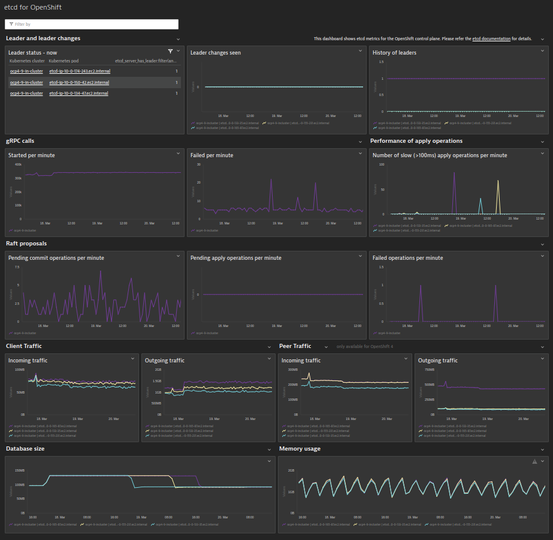
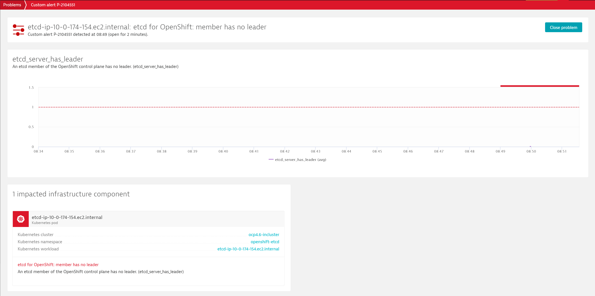
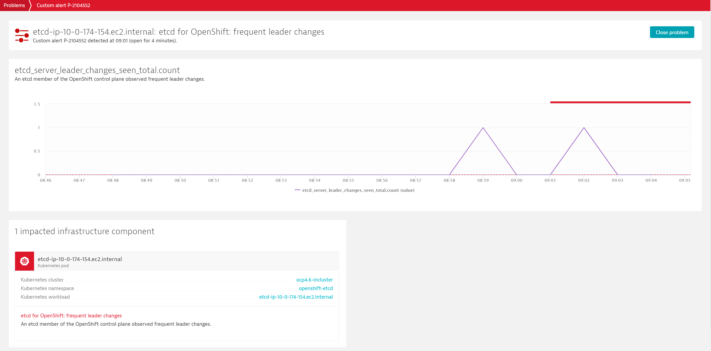
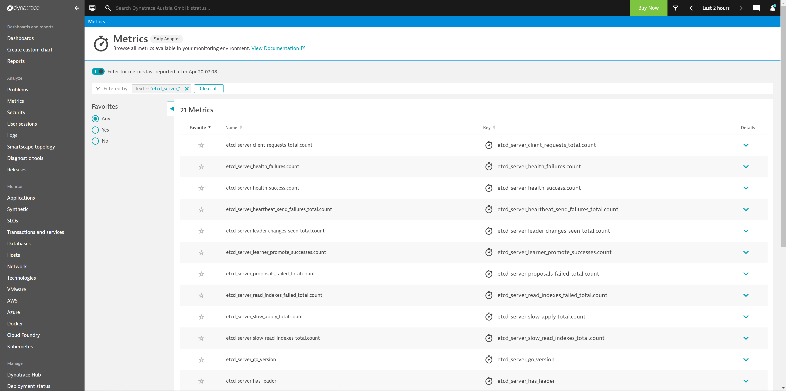
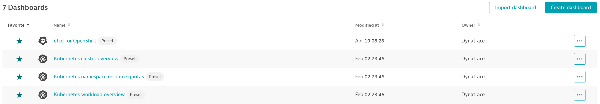
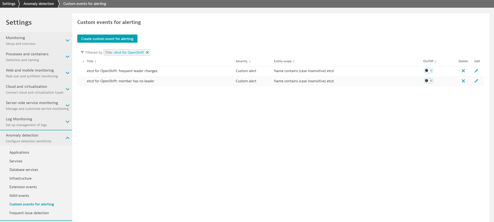

# etcd for OpenShift
This extension provides you with deep insights into your self-managed [OpenShift](https://www.openshift.com/) control plane using [etcd metrics](https://etcd.io/docs/current/metrics/) exposed on your cluster in the Prometheus/[OpenMetrics](https://github.com/OpenObservability/OpenMetrics) format. It provides an out-of-the-box [dashboard](#screenshots) and pre-configured [alerts](#screenshots). To give you a brief impression what you get with this extension, have a look at the [screenshots](#screenshots) below. Of course, you can also build your own [dashboards](https://www.dynatrace.com/support/help/shortlink/custom-dashboards) and [metric events for alerting](https://www.dynatrace.com/support/help/shortlink/metric-events-for-alerting) based on the [metrics exposed by etcd](https://etcd.io/docs/current/metrics/).

## <a name="screenshots"></a>Screenshots
Dashboard             |  No leader event | Frequent leader changes event
:-------------------------:|:-------------------------:|:-----:
  |   | 

## <a name="permissions"></a> Prerequisites and supported versions

* Dynatrace version 1.222+
* ActiveGate version 1.222+ running within the Kubernetes cluster. To have an ActiveGate in your Kubernetes cluster, deploy Dynatrace using [Dynatrace Operator](https://www.dynatrace.com/support/help/shortlink/full-stack-dto-k8) (recommended) or deploy an [ActiveGate as a StatefulSet](https://www.dynatrace.com/support/help/shortlink/connect-kubernetes-clusters).
* OpenShift 4 and OpenShift 3 (self-managed)
* Granted permission to 'configmaps/get' and 'secrets/get' for the service account used for Kubernetes API monitoring (typically, dynatrace-kubernetes-monitoring)


## Install extension

Follow the steps to install the etcd for OpenShift extension.

### 1. Enable Prometheus monitoring in Dynatrace
In your Dynatrace environment, go to **Settings** > **Cloud and virtualization** > **Kubernetes** and turn on **Enable monitoring** and **Monitor Prometheus exporters**. For more information see our [official documentation](https://www.dynatrace.com/support/help/shortlink/monitor-prometheus-metrics).

### <a name="ingestmetrics"></a> 2. Start ingesting etcd metrics
To ingest metrics exposed by etcd, the related service needs to be annotated with specific Dynatrace annotations. Based on the used OpenShift version, use the corresponding instructions below. Before executing any of the instructions below, ensure your kubectl is configured to use the Kubernetes cluster you want to monitor.

#### OpenShift 4
```
kubectl annotate --overwrite service etcd -n openshift-etcd \
metrics.dynatrace.com/port='9979' metrics.dynatrace.com/scrape='true' metrics.dynatrace.com/secure='true' \
metrics.dynatrace.com/tls.ca.crt='configmap:openshift-config:etcd-metric-serving-ca:ca-bundle.crt' \
metrics.dynatrace.com/tls.crt='secret:openshift-config:etcd-metric-client:tls.crt' \
metrics.dynatrace.com/tls.key='secret:openshift-config:etcd-metric-client:tls.key'
```
#### OpenShift 3
For OpenShift 3, the required TLS files need to be created and stored in secrets - creating the same situation that is the default for OpenShift 4. To achieve this easily, we provide a script that follows the [official documentation of OpenShift](https://docs.openshift.com/container-platform/3.11/install_config/prometheus_cluster_monitoring.html#configuring-etcd-monitoring_prometheus-cluster-monitoring). For executing the script, download the [script](https://github.com/dynatrace-extensions/etcd-for-k8s-control-plane/scripts/activate_etcd_scraping_ocp3.sh) itself and the [dynatrace-monitoring-etcd-ocp3-service.yaml](https://github.com/dynatrace-extensions/etcd-for-k8s-control-plane/scripts/dynatrace-monitoring-etcd-ocp3-service.yaml) file. Store both files in a single folder and execute the ```activate_etcd_scraping_ocp3.sh``` script.

#### Verification and troubleshooting
After some minutes, you can verify if everything works as expected by finding etcd related metrics using [Dynatrace metrics browser](https://www.dynatrace.com/support/help/shortlink/metrics-browser). etcd metrics are prefixed with `etcd_` string, for example `etcd_server_has_leader`. 




For troubleshooting and further annotation methods, see [Monitor Prometheus metrics](https://www.dynatrace.com/support/help/shortlink/monitor-prometheus-metrics) in Dynatrace documentation.

### 3. Install the extension package
To get the out-of-the-box dashboard and pre-configured alerts included in this extension, navigate to the **Dynatrace Hub** within Dynatrace and search for "etcd". Select the "etcd for OpenShift" tile and follow the on-screen guidance to activate the extension. After activating the extension, select **Dashboards** in Dynatrace. You should now find an out-of-the-box **etcd for OpenShift** dashboard.

</br>

### 4. Activate metric events for alerting
Additionally, the extension comes with the two pre-configured metric events for alerting. To activate them:
1. From the Dynatrace navigation menu, select **Settings** > **Anomaly detection** > **Custom events for alerting**.
2. Find the following events

   </br>

   
   * **etcd for OpenShift: member has no leader:**  notifies you if any etcd member does not have a leader. Per default, this event immediately triggers as soon as any etcd member is missing a leader. 
   * **etcd for OpenShift: frequent leader changes:**  checks for frequent leader changes within etcd. Per default, this event triggers if any etcd member observes more than one leader change within an hour.
3. If necessary, select the **Edit** button to customize the event conditions.
4. Move the switch next an event to the **On** position to activate it.

## Uninstall the extension
### 1. Stop metric ingest
As metric ingest is subject to [DDU consumption](https://www.dynatrace.com/support/help/shortlink/monitor-prometheus-metrics#monitoring-consumption), it is important to stop it by removing the annotations from the etcd service. If you followed the instructions described in the ["Start ingesting etcd metrics"](#ingestmetrics) section, you can use kubectl to remove the annotations.
#### OpenShift 4
```
kubectl annotate service etcd -n openshift-etcd \
metrics.dynatrace.com/port- metrics.dynatrace.com/scrape- metrics.dynatrace.com/secure- \
metrics.dynatrace.com/tls.ca.crt- metrics.dynatrace.com/tls.crt- metrics.dynatrace.com/tls.key-
```
#### OpenShift 3
```
kubectl delete configmap etcd-data -n dynatrace
kubectl delete secret etcd-data -n dynatrace
kubectl delete service dynatrace-monitoring-etcd-ocp3 -n kube-system
```
### 2. Deactivate the extension
To remove the out-of-the-box dashboard and alerts, deactivate the extension via the **Dynatrace Hub**.
